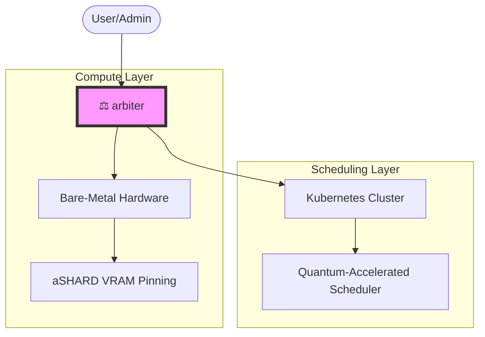

# ⚖️ arbiter

> [!IMPORTANT]
> **Project Status: Experimental**
> `arbiter` is currently in an early experimental phase. Its APIs and core functionality are subject to significant changes. It is not recommended for use in production environments at this time.

Dual nature—combining bare-metal virtualized hardware management (aSHARD VRAM pinning) with quantum-accelerated Kubernetes scheduling.

## 📖 Overview

`arbiter` is a specialized orchestration layer designed for high-performance computing environments. It bridges the gap between low-level hardware management and cloud-native scheduling, providing a unified interface for managing virtualized resources with precision.

## 🚀 Key Features

- 🏗️ **Infrastructure Awareness**: Directly manages bare-metal resources for maximum performance.
- 📍 **VRAM Optimization**: Uses aSHARD pinning to eliminate GPU memory fragmentation.
- ⚛️ **Next-Gen Scheduling**: Leverages quantum-accelerated algorithms for complex Kubernetes workloads.
- ⚖️ **Unified Orchestration**: A single control plane for both hardware and cluster-level operations.

## ⚖️ License

This project is licensed under the [MIT License](LICENSE).
