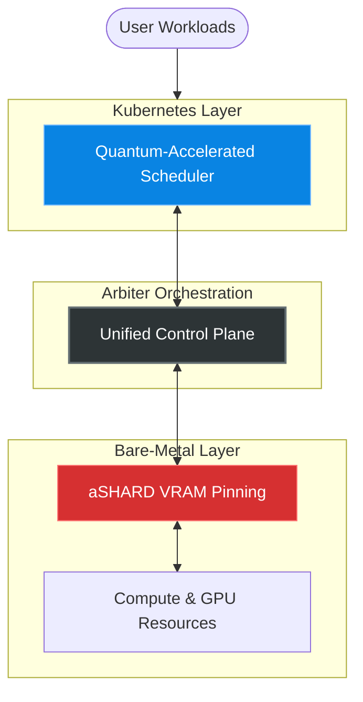

# ⚖️ arbiter

Dual nature—combining bare-metal virtualized hardware management (aSHARD VRAM pinning) with quantum-accelerated Kubernetes scheduling.

> [!IMPORTANT]
> `arbiter` is currently in an experimental state. It is not recommended for production workloads requiring high stability or critical uptime.

## 📖 Overview

`arbiter` is a specialized orchestration layer designed for high-performance computing environments. It bridges the gap between low-level hardware management and cloud-native scheduling, providing a unified interface for managing virtualized resources with precision.

### 🏗️ Architecture

## 🚀 Key Features

- 🏗️ **Infrastructure Awareness**: Directly manages bare-metal resources for maximum performance.
- 📍 **VRAM Optimization**: Uses aSHARD pinning to eliminate GPU memory fragmentation.
- ⚛️ **Next-Gen Scheduling**: Leverages quantum-accelerated algorithms for complex Kubernetes workloads.
- ⚖️ **Unified Orchestration**: A single control plane for both hardware and cluster-level operations.

## ⚖️ License

This project is licensed under the [MIT License](LICENSE).
