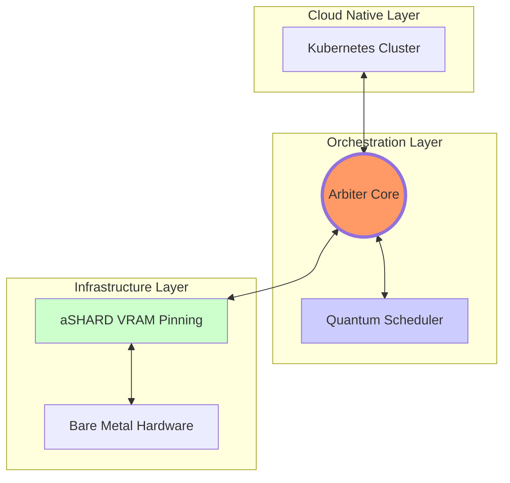

# ⚖️ arbiter

> [!CAUTION]
> This project is currently in an **Experimental** state. It is not recommended for production use as APIs and core functionality are subject to significant change.

Dual nature—combining bare-metal virtualized hardware management (aSHARD VRAM pinning) with quantum-accelerated Kubernetes scheduling.

## 📖 Overview

`arbiter` is a specialized orchestration layer designed for high-performance computing environments. It bridges the gap between low-level hardware management and cloud-native scheduling, providing a unified interface for managing virtualized resources with precision.

## 🏗️ Architecture

```mermaid
graph TD
    subgraph "Cloud Native Layer"
        K8s[Kubernetes Cluster]
    end

    subgraph "Orchestration Layer"
        Arbiter((Arbiter Core))
        QS[Quantum Scheduler]
    end

    subgraph "Infrastructure Layer"
        BM[Bare Metal Hardware]
        VRAM[aSHARD VRAM Pinning]
    end

    K8s <--> Arbiter
    Arbiter <--> QS
    Arbiter <--> VRAM
    VRAM <--> BM

    style Arbiter fill:#f96,stroke-width:4px
    style QS fill:#ccf
    style VRAM fill:#cfc
```

## 🚀 Key Features

- 🏗️ **Infrastructure Awareness**: Directly manages bare-metal resources for maximum performance.
- 📍 **VRAM Optimization**: Uses aSHARD pinning to eliminate GPU memory fragmentation.
- ⚛️ **Next-Gen Scheduling**: Leverages quantum-accelerated algorithms for complex Kubernetes workloads.
- ⚖️ **Unified Orchestration**: A single control plane for both hardware and cluster-level operations.

## 🧪 Context

`arbiter` was conceived by **Igor Holt** (AI Architect) as a critical resource orchestration component within the **Genesis Conductor Engine**. It serves as the bridge between raw infrastructure and high-level AI workload scheduling.

## ⚖️ License

This project is licensed under the [MIT License](LICENSE).
