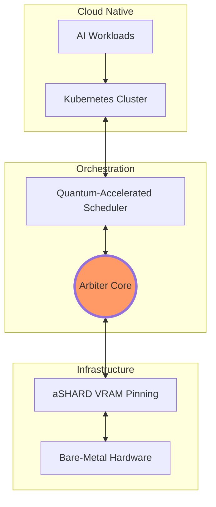

# ⚖️ arbiter

> [!CAUTION]
> This project is experimental and under active development. It is not recommended for production use.

Dual nature—combining bare-metal virtualized hardware management (aSHARD VRAM pinning) with quantum-accelerated Kubernetes scheduling.

## 📖 Overview

`arbiter` is a specialized orchestration layer designed for high-performance computing environments. It bridges the gap between low-level hardware management and cloud-native scheduling, providing a unified interface for managing virtualized resources with precision.

```mermaid
graph TD
    subgraph CloudNative [Cloud Native]
        K8s[Kubernetes Cluster]
        Workloads[AI Workloads]
    end

    subgraph Orchestration [Orchestration]
        Arbiter((Arbiter Core))
        Scheduler[Quantum-Accelerated Scheduler]
    end

    subgraph Infrastructure [Infrastructure]
        BareMetal[Bare-Metal Hardware]
        aSHARD[aSHARD VRAM Pinning]
    end

    Workloads --> K8s
    K8s <--> Scheduler
    Scheduler <--> Arbiter
    Arbiter <--> aSHARD
    aSHARD <--> BareMetal

    style Arbiter fill:#f96,stroke-width:4px
```

## 🚀 Key Features

- 🏗️ **Infrastructure Awareness**: Provides direct access to bare-metal resources, bypassing virtualization overhead for maximum performance.
- 📍 **VRAM Optimization**: Implements aSHARD pinning to ensure deterministic GPU memory allocation and eliminate fragmentation.
- ⚛️ **Next-Gen Scheduling**: Features quantum-accelerated algorithms designed to solve complex multi-dimensional resource constraints for Kubernetes workloads.
- ⚖️ **Unified Orchestration**: Bridges low-level hardware management with high-level cluster scheduling via a single, cohesive control plane.

## ⚖️ License

This project is licensed under the [MIT License](LICENSE).
