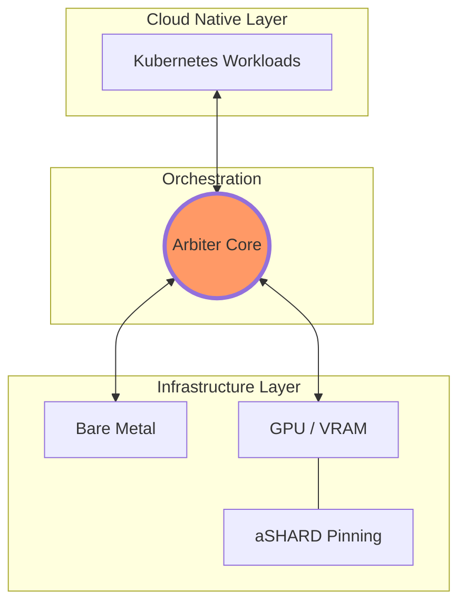

# ⚖️ arbiter

> [!CAUTION]
> This project is currently **Experimental**. It is not recommended for production environments as APIs and core functionality are subject to significant breaking changes.

Dual nature—combining bare-metal virtualized hardware management (aSHARD VRAM pinning) with quantum-accelerated Kubernetes scheduling.

## 📖 Overview

`arbiter` is a specialized orchestration layer designed for high-performance computing environments. It bridges the gap between low-level hardware management and cloud-native scheduling, providing a unified interface for managing virtualized resources with precision.

```mermaid
graph TD
    subgraph "Cloud Native Layer"
        K8S[Kubernetes Workloads]
    end

    subgraph "Orchestration"
        Arbiter((Arbiter Core))
        style Arbiter fill:#f96,stroke-width:4px
    end

    subgraph "Infrastructure Layer"
        BM[Bare Metal]
        GPU[GPU / VRAM]
        aSHARD[aSHARD Pinning]
    end

    K8S <--> Arbiter
    Arbiter <--> BM
    Arbiter <--> GPU
    GPU --- aSHARD
```

## 🚀 Key Features

- 🏗️ **Infrastructure Awareness**: Directly manages bare-metal resources for maximum performance.
- 📍 **VRAM Optimization**: Uses aSHARD pinning to eliminate GPU memory fragmentation.
- ⚛️ **Next-Gen Scheduling**: Leverages quantum-accelerated algorithms for complex Kubernetes workloads.
- ⚖️ **Unified Orchestration**: A single control plane for both hardware and cluster-level operations.

## 🧪 Context

`arbiter` was developed by **Igor Holt** (AI Architect) as part of the **Genesis Conductor Engine**. It serves as the critical resource orchestration layer for AI workloads, bridging low-level hardware constraints with high-level cloud scheduling requirements.

## ⚖️ License

This project is licensed under the [MIT License](LICENSE).
