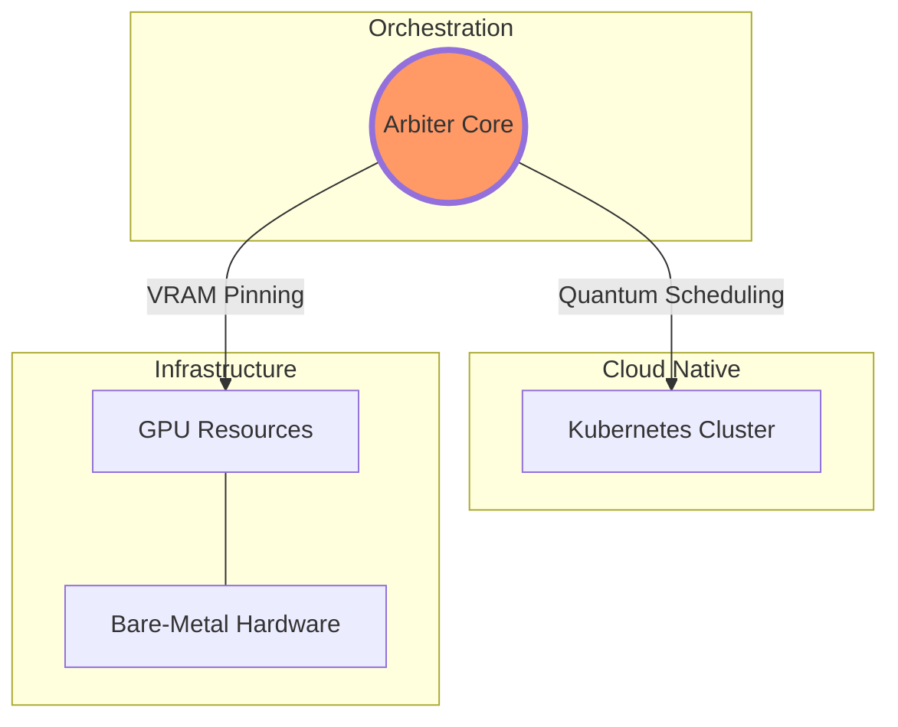

# ⚖️ arbiter

> [!CAUTION]
> This project is currently **Experimental**. It is not recommended for production use as it involves low-level hardware manipulation and next-gen scheduling algorithms.

Dual nature—combining bare-metal virtualized hardware management (aSHARD VRAM pinning) with quantum-accelerated Kubernetes scheduling.

## 📖 Overview

`arbiter` is a specialized orchestration layer designed for high-performance computing environments. It bridges the gap between low-level hardware management and cloud-native scheduling, providing a unified interface for managing virtualized resources with precision.

```mermaid
graph TD
    subgraph Cloud_Native [Cloud Native]
        K8s[Kubernetes Cluster]
    end

    subgraph Orchestration
        Arbiter((Arbiter Core))
        style Arbiter fill:#f96,stroke-width:4px
    end

    subgraph Infrastructure
        Metal[Bare-Metal Hardware]
        GPU[GPU Resources]
    end

    Arbiter -->|Quantum Scheduling| K8s
    Arbiter -->|VRAM Pinning| GPU
    GPU --- Metal
```

## 🚀 Key Features

- 🏗️ **Infrastructure Awareness**: Directly manages bare-metal resources for maximum performance.
- 📍 **VRAM Optimization**: Uses aSHARD pinning to eliminate GPU memory fragmentation.
- ⚛️ **Next-Gen Scheduling**: Leverages quantum-accelerated algorithms for complex Kubernetes workloads.
- ⚖️ **Unified Orchestration**: A single control plane for both hardware and cluster-level operations.

## 🧪 Context

`arbiter` was created by **Igor Holt** (AI Architect) as part of the **Genesis Conductor Engine**. It serves as the resource orchestration layer for AI workloads within the infrastructure, bridging the gap between hardware management and high-level scheduling.

## ⚖️ License

This project is licensed under the [MIT License](LICENSE).
