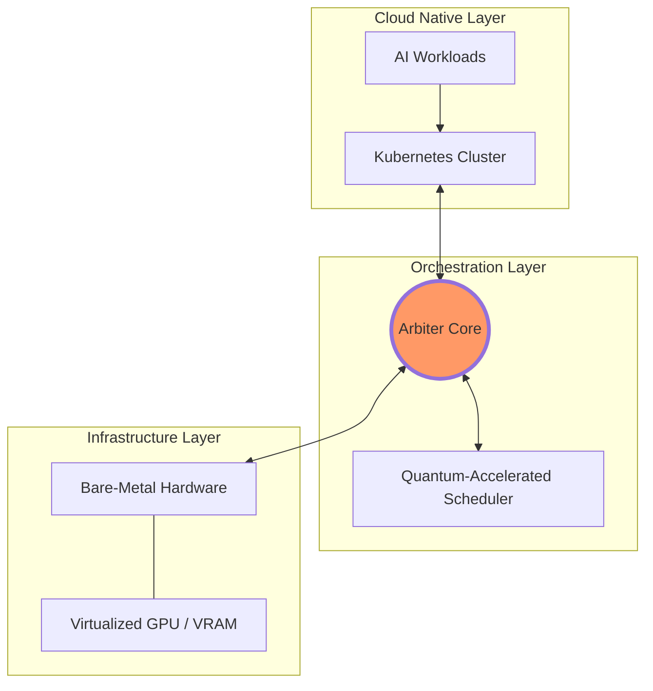

# ⚖️ arbiter

> [!CAUTION]
> This project is currently **experimental** and is not recommended for production use. The API and core orchestration features are subject to rapid change as we stabilize the system.

Dual nature—combining bare-metal virtualized hardware management (aSHARD VRAM pinning) with quantum-accelerated Kubernetes scheduling.

## 📖 Overview

`arbiter` is a specialized orchestration layer designed for high-performance computing environments. It bridges the gap between low-level hardware management and cloud-native scheduling, providing a unified interface for managing virtualized resources with precision.

```mermaid
graph TD
    subgraph "Cloud Native Layer"
        K8S[Kubernetes Cluster]
        APP[AI Workloads]
    end

    subgraph "Orchestration Layer"
        Arbiter((Arbiter Core))
        SCHED[Quantum-Accelerated Scheduler]
    end

    subgraph "Infrastructure Layer"
        BM[Bare-Metal Hardware]
        GPU[Virtualized GPU / VRAM]
    end

    APP --> K8S
    K8S <--> Arbiter
    Arbiter <--> SCHED
    Arbiter <--> BM
    BM --- GPU

    style Arbiter fill:#f96,stroke-width:4px
```

## 🚀 Key Features

- 🏗️ **Infrastructure Awareness**: Directly manages bare-metal resources to bypass virtualization overhead and maximize raw hardware performance.
- 📍 **VRAM Optimization**: Implements aSHARD pinning for granular GPU memory allocation, effectively eliminating fragmentation in high-demand AI environments.
- ⚛️ **Quantum-Accelerated Scheduling**: Leverages next-gen algorithms to optimize complex Kubernetes workload distribution across hybrid cloud/edge deployments.
- ⚖️ **Unified Orchestration**: Provides a single, cohesive control plane for synchronizing low-level hardware state with high-level cluster requirements.
- 🔌 **Cloud-Native Integration**: Seamlessly bridges the gap between traditional bare-metal management and modern container orchestration.

## ⚖️ License

This project is licensed under the [MIT License](LICENSE).
