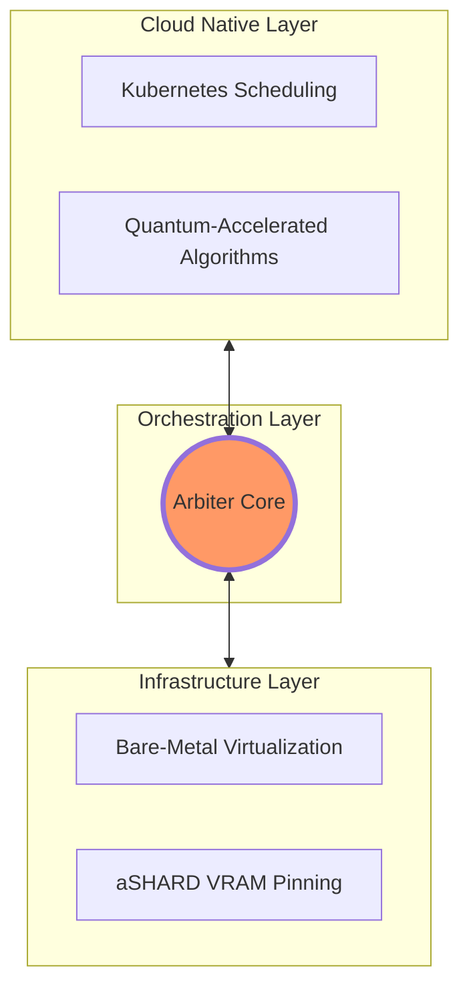

# ⚖️ arbiter

> [!CAUTION]
> This project is currently **Experimental**. It is not recommended for production use as it is under active development and APIs may change without notice.

Dual nature—combining bare-metal virtualized hardware management (aSHARD VRAM pinning) with quantum-accelerated Kubernetes scheduling.

## 🧪 Context

`arbiter` was created by **Igor Holt** (AI Architect) as part of the **Genesis Conductor Engine**. It serves as a critical resource orchestration layer for AI workloads, bridging the gap between low-level hardware and cloud-native scheduling.

## 📖 Overview

`arbiter` is a specialized orchestration layer designed for high-performance computing environments. It bridges the gap between low-level hardware management and cloud-native scheduling, providing a unified interface for managing virtualized resources with precision.

## 🚀 Key Features

- 🏗️ **Infrastructure Awareness**: Directly manages bare-metal resources for maximum performance.
- 📍 **VRAM Optimization**: Uses aSHARD pinning to eliminate GPU memory fragmentation.
- ⚛️ **Next-Gen Scheduling**: Leverages quantum-accelerated algorithms for complex Kubernetes workloads.
- ⚖️ **Unified Orchestration**: A single control plane for both hardware and cluster-level operations.

## 🗺️ Architecture

```mermaid
graph TD
    subgraph CloudNative [Cloud Native Layer]
        K8s[Kubernetes Scheduling]
        Quantum[Quantum-Accelerated Algorithms]
    end

    subgraph Orchestration [Orchestration Layer]
        Arbiter((Arbiter Core))
    end

    subgraph Infrastructure [Infrastructure Layer]
        BareMetal[Bare-Metal Virtualization]
        VRAM[aSHARD VRAM Pinning]
    end

    CloudNative <--> Arbiter
    Arbiter <--> Infrastructure

    style Arbiter fill:#f96,stroke-width:4px
```

## ⚖️ License

This project is licensed under the [MIT License](LICENSE).
