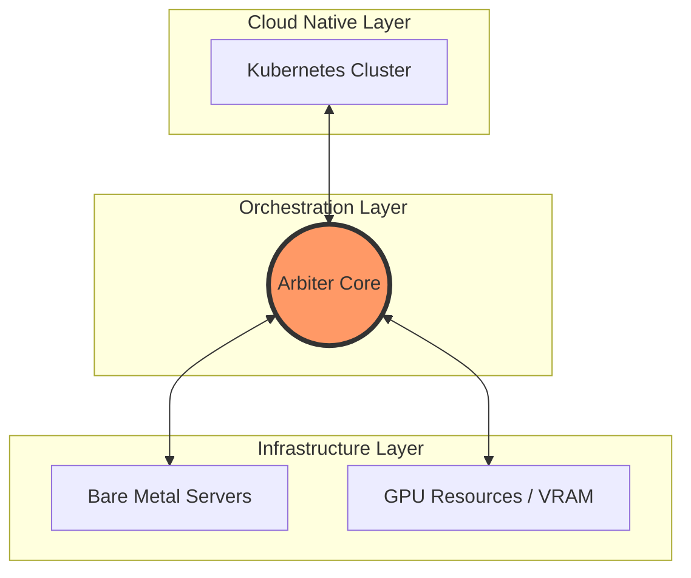

# ⚖️ arbiter

> [!CAUTION]
> This project is currently **Experimental**. It is not recommended for production use and is subject to significant changes as the architecture evolves.

Dual nature—combining bare-metal virtualized hardware management (aSHARD VRAM pinning) with quantum-accelerated Kubernetes scheduling.

## 📖 Overview

`arbiter` is a specialized orchestration layer designed for high-performance computing environments. It bridges the gap between low-level hardware management and cloud-native scheduling, providing a unified interface for managing virtualized resources with precision.

## 🏗️ Architecture

```mermaid
graph TD
    subgraph CloudNative [Cloud Native Layer]
        K8s[Kubernetes Cluster]
    end

    subgraph Orchestration [Orchestration Layer]
        Arbiter((Arbiter Core))
    end

    subgraph Infrastructure [Infrastructure Layer]
        BareMetal[Bare Metal Servers]
        GPU[GPU Resources / VRAM]
    end

    K8s <--> Arbiter
    Arbiter <--> BareMetal
    Arbiter <--> GPU

    style Arbiter fill:#f96,stroke:#333,stroke-width:4px
```

## 🚀 Key Features

- 🏗️ **Bare-Metal Precision**: Bypass virtualization overhead with direct hardware management for latency-sensitive AI workloads.
- 📍 **Intelligent VRAM Pinning**: Maximize GPU utilization and eliminate fragmentation using aSHARD-driven memory allocation.
- ⚛️ **Quantum-Accelerated Scheduling**: Resolve complex multi-constraint resource allocations faster than traditional heuristics.
- ⚖️ **Unified Control Plane**: Seamlessly bridge the gap between low-level hardware states and high-level Kubernetes orchestration.

## ⚖️ License

This project is licensed under the [MIT License](LICENSE).
