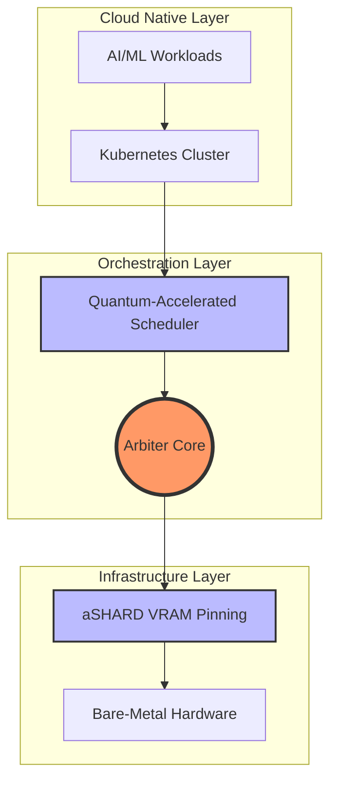

# ⚖️ arbiter

> [!CAUTION]
> This project is currently in an experimental state and is not recommended for production use.

Dual nature—combining bare-metal virtualized hardware management (aSHARD VRAM pinning) with quantum-accelerated Kubernetes scheduling.

## 📖 Overview

`arbiter` is a specialized orchestration layer designed for high-performance computing environments. It bridges the gap between low-level hardware management and cloud-native scheduling, providing a unified interface for managing virtualized resources with precision.

## 🚀 Key Features

- 🏗️ **Infrastructure Awareness**: Directly manages bare-metal resources for maximum performance.
- 📍 **VRAM Optimization**: Uses aSHARD pinning to eliminate GPU memory fragmentation.
- ⚛️ **Next-Gen Scheduling**: Leverages quantum-accelerated algorithms for complex Kubernetes workloads.
- ⚖️ **Unified Orchestration**: A single control plane for both hardware and cluster-level operations.

## 🏗️ Architecture

```mermaid
graph TD
    subgraph CloudNative [Cloud Native Layer]
        K8s[Kubernetes Cluster]
        Workloads[AI/ML Workloads]
    end

    subgraph Orchestration [Orchestration Layer]
        Arbiter((Arbiter Core))
        Scheduler[Quantum-Accelerated Scheduler]
    end

    subgraph Infrastructure [Infrastructure Layer]
        BareMetal[Bare-Metal Hardware]
        aSHARD[aSHARD VRAM Pinning]
    end

    Workloads --> K8s
    K8s --> Scheduler
    Scheduler --> Arbiter
    Arbiter --> aSHARD
    aSHARD --> BareMetal

    style Arbiter fill:#f96,stroke:#333,stroke-width:4px
    style Scheduler fill:#bbf,stroke:#333,stroke-width:2px
    style aSHARD fill:#bbf,stroke:#333,stroke-width:2px
```

## 🧪 Context

`arbiter` was created by **Igor Holt** (AI Architect) as part of the **Genesis Conductor Engine**. It serves as the resource orchestration layer for AI workloads within the engine's infrastructure, bridging the gap between hardware management and cloud-native scheduling.

## ⚖️ License

This project is licensed under the [MIT License](LICENSE).
